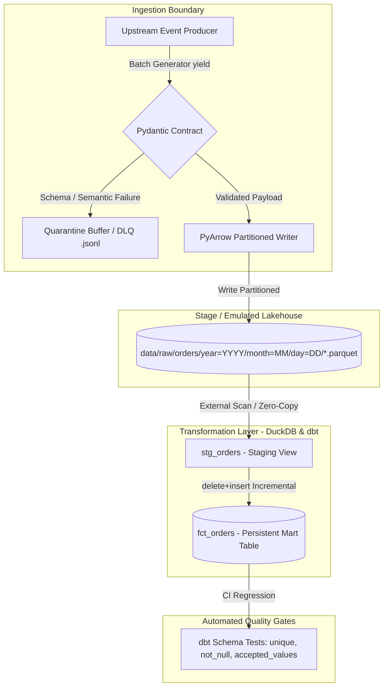

# Enterprise ELT Lakehouse Engine (Local to Cloud Architecture)

A production-grade, containerized ELT data pipeline implementing a Medallion Architecture. Built with Python streaming generators, strict data contracts (Pydantic), a Dead-Letter Queue (DLQ) pattern, columnar partitioned storage (Parquet), DuckDB for local decoupled OLAP compute, and dbt for idempotent incremental modeling.

---

## Architecture Overview

Key Engineering Decisions & Trade-offs
1. Ingestion Boundary & Resiliency (DLQ Pattern)

    The Problem: Ingesting directly into storage without validation leads to silent schema drift and semantic corruption (e.g., negative revenue values, unparseable timestamps).

    The Solution: Implemented strict Pydantic v2 schemas at runtime. Instead of failing the entire batch (violating availability SLAs), anomalous records are dynamically routed to a Dead-Letter Queue (data/quarantine/corrupted_orders.jsonl) with structural error traces for observability.

2. Decoupled Compute & Zero-Copy Staging

    The Problem: Ingesting raw files into relational tables doubles storage costs and adds unnecessary I/O overhead.

    The Solution: Leveraged DuckDB's in-process vectorized engine to query external Parquet files directly via glob patterns (meta: external_location). The staging layer (stg_orders) is materialized as a view, achieving zero-copy staging with sub-second execution overhead.

3. Idempotent Incremental Builds

    The Problem: Full-table refreshes become compute-prohibitive at scale, while naive INSERT INTO operations create duplicate records upon pipeline retries.

    The Solution: Configured fct_orders with an incremental strategy (delete+insert) indexed by a deterministic surrogate key (md5(order_id)). Subsequent runs scan only new records (created_at_utc > max(created_at_utc)), achieving sub-tenth-of-a-second execution times with guaranteed primary-key uniqueness.

Repository Structure
Plaintext

├── .github/workflows/
│   └── ci.yml                  # GitHub Actions CI pipeline running pytest & dbt test
├── analytics_dbt/
│   ├── models/
│   │   ├── staging/            # Staging views & external source definitions
│   │   │   ├── sources.yml
│   │   │   └── stg_orders.sql
│   │   └── marts/              # Dimensional tables and quality tests
│   │       ├── marts.yml
│   │       └── fct_orders.sql
│   ├── dbt_project.yml
│   └── profiles.yml
├── data/                       # Local volume mounts (ignored in Git)
│   ├── raw/                    # Date-partitioned Parquet datasets
│   └── quarantine/             # Dead-Letter Queue buffer (JSONL)
├── src/
│   ├── ingestion/
│   │   ├── models.py           # Pydantic data contracts
│   │   ├── producer.py         # Memory-efficient batch generator (yield)
│   │   └── writer.py           # PyArrow columnar serializer
│   ├── main.py                 # Ingestion driver with DLQ routing
│   └── pipeline_runner.py      # End-to-end programmatic orchestrator
├── tests/
│   └── test_validation.py      # Contract & anomaly regression tests
├── docker-compose.yml
└── requirements.txt

Quickstart & Local Reproduction

This project is fully containerized to ensure reproducibility across any Linux/macOS/Windows host.
Prerequisites

    Docker & Docker Compose

    Git

Running the End-to-End Pipeline
Bash

# 1. Spin up the containerized environment
docker-compose up -d

# 2. Enter the container shell
docker-compose exec app bash

# 3. Run the automated pipeline orchestrator
python -m src.pipeline_runner

Running Test Suites
Bash

# Unit tests (Pydantic contracts & DLQ handling)
python -m pytest -v

# Data quality tests (dbt schema validations)
cd analytics_dbt
dbt test --profiles-dir .
